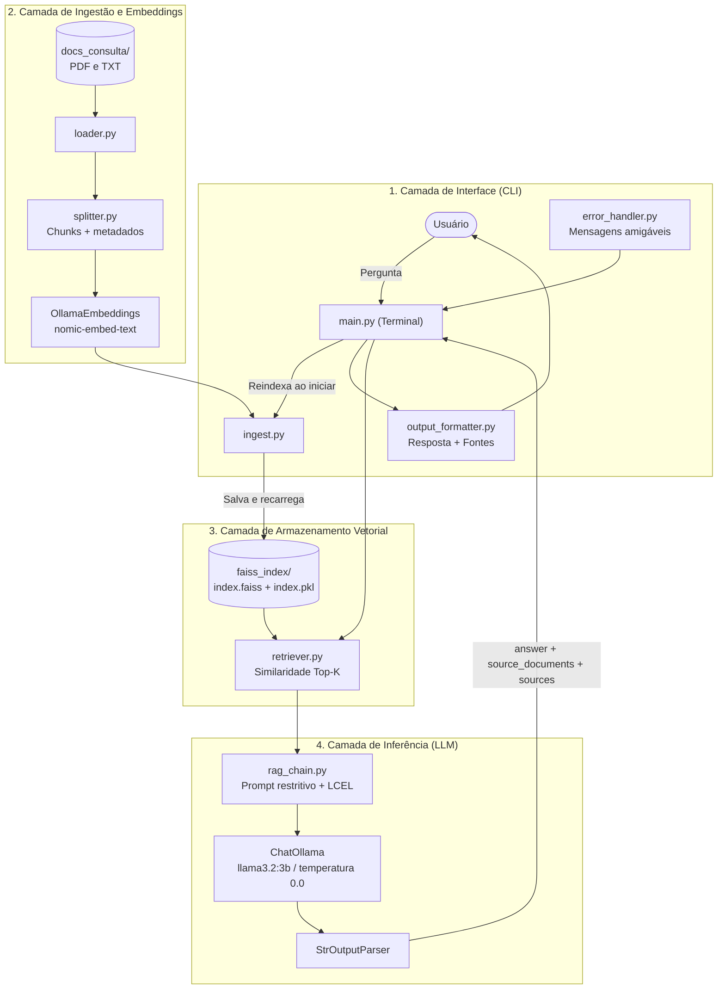

# RAG Local com LangChain, FAISS e Ollama

Pipeline de *Retrieval-Augmented Generation* (RAG) local, projetado para consulta semântica e geração de respostas baseadas exclusivamente em documentos armazenados no diretório `docs_consulta/`. Após a instalação dos pacotes e o download dos modelos, documentos, vetores e inferências permanecem na máquina local, sem APIs pagas.

---

## 1. Stacks e Tecnologias

| Componente | Tecnologia | Finalidade Técnica |
| :--- | :--- | :--- |
| **Linguagem** | Python 3.12+ | Ambiente base de execução |
| **Orquestração RAG** | LangChain (`langchain`, `langchain-community`, `langchain-ollama`) | Gestão de cadeias de recuperação, injeção de contexto e templates de prompt |
| **Vector Store** | FAISS (`faiss-cpu`) | Indexação vetorial em memória e persistência local para busca por similaridade |
| **Embeddings** | Ollama (`nomic-embed-text`) | Vetorização semântica local dos chunks |
| **LLM Local** | Ollama (`llama3.2:3b`) | Geração local com temperatura baixa |
| **Carga documental** | PyPDFLoader / pathlib | Extração de PDFs e leitura resiliente de arquivos `.txt` |

---

## 2. Arquitetura da Solução



---

## 3. Estrutura do Projeto

```
.
├── .gitignore
├── README.md
├── requirements.txt
├── docs/                 # Escopo, backlog concluído e diagrama arquitetural
├── docs_consulta/        # Diretório de entrada dos documentos para consulta
├── faiss_index/          # Armazenamento persistido dos índices vetoriais
├── src/
│   ├── config.py         # Parâmetros gerais (modelos, chunk size, overlap)
│   ├── loader.py         # Carga de arquivos PDF e TXT
│   ├── splitter.py       # Fragmentação e metadados dos documentos
│   ├── embeddings.py     # Cliente local de embeddings Ollama
│   ├── ingest.py         # Criação, persistência e reload do FAISS
│   ├── retriever.py      # Busca semântica Top-K
│   ├── llm.py            # Cliente ChatOllama local
│   ├── rag_chain.py      # Cadeia LCEL com resposta e fontes
│   ├── output_formatter.py # Formatação da saída no terminal
│   └── error_handler.py  # Mensagens amigáveis para falhas comuns
└── main.py               # Ponto de entrada para execução e interface CLI
```

## 4. Instalação

Requisitos: Python 3.12 ou superior e [Ollama](https://ollama.com/) instalado.

```
python -m venv .venv
.\.venv\Scripts\python.exe -m pip install -r requirements.txt
ollama pull nomic-embed-text
ollama pull llama3.2:3b
```

O Ollama deve estar ativo em `http://localhost:11434`.

Em Linux, macOS ou WSL, ative o ambiente e substitua o prefixo dos comandos por:

```bash
source .venv/bin/activate
python -m pip install -r requirements.txt
```

## 5. Uso

Adicione arquivos `.pdf` ou `.txt` em `docs_consulta/` e gere o índice:

```
.\.venv\Scripts\python.exe src\ingest.py
```

Valide o reload sem reprocessar os documentos:

```
.\.venv\Scripts\python.exe src\ingest.py --load-only
```

Inicie o modo interativo ou faça uma consulta direta:

```
.\.venv\Scripts\python.exe main.py
.\.venv\Scripts\python.exe main.py -q "Qual é a informação desejada?"
```

Toda execução de `main.py` faz automaticamente a carga dos arquivos, o chunking,
a geração de embeddings e a substituição do índice em `faiss_index/` antes de
aceitar consultas. Assim, alterações em `docs_consulta/` entram em vigor na
próxima inicialização do CLI. O Ollama precisa estar ativo também durante essa
etapa, pois o índice é reconstruído com `nomic-embed-text`.

O comando manual `src\ingest.py` continua disponível para gerar ou validar o
índice sem iniciar o CLI.

No modo interativo, use `ajuda`, `limpar`, `sair` ou `exit` quando necessário.

A saída de cada consulta segue este contrato:

```
[Resposta]: <texto fundamentado no contexto>

[Fontes Consultadas]:
- manual.pdf (Página 2)
- notas.txt (Trecho 1)
```

Quando o contexto não sustenta a pergunta, a resposta é:

```
Não foi possível encontrar a resposta no contexto fornecido.
```

## 6. Configuração opcional

As configurações podem ser definidas em um arquivo `.env`:

```
DOCS_DIR=docs_consulta
FAISS_INDEX_DIR=faiss_index
CHUNK_SIZE=1000
CHUNK_OVERLAP=150
OLLAMA_BASE_URL=http://localhost:11434
EMBEDDING_MODEL_NAME=nomic-embed-text
LLM_MODEL_NAME=llama3.2:3b
LLM_TEMPERATURE=0.0
LLM_NUM_CTX=4096
LLM_NUM_PREDICT=512
LLM_NUM_THREAD=
LLM_NUM_GPU=
LLM_KEEP_ALIVE=5m
TOP_K_RESULTS=4
```

O índice e os documentos locais são ignorados pelo Git. O arquivo `index.pkl`
deve ser carregado somente quando produzido localmente por este projeto.

### Alterar a LLM local

Consulte os modelos instalados e baixe o modelo desejado:

```
ollama list
ollama pull llama3.2:1b
```

Em seguida, altere somente `LLM_MODEL_NAME` no `.env`:

```
LLM_MODEL_NAME=llama3.2:1b
```

Reinicie o `main.py` para aplicar a alteração. O índice será recriado
automaticamente na inicialização. Se `EMBEDDING_MODEL_NAME` for alterado, essa
recriação garante que consulta e índice usem o mesmo modelo de embeddings.

Modelos menores costumam responder mais rápido e consumir menos memória, enquanto
modelos maiores tendem a produzir respostas melhores, mas exigem mais RAM/VRAM.

### Ajustar desempenho das consultas

As opções abaixo podem ser configuradas no `.env`:

| Opção | Efeito | Sugestão inicial |
| :--- | :--- | :--- |
| `LLM_NUM_CTX` | Tamanho da janela de contexto; valores menores reduzem memória e processamento | `2048` ou `4096` |
| `LLM_NUM_PREDICT` | Máximo de tokens gerados; reduzi-lo diminui o tempo de resposta | `256` a `512` |
| `LLM_NUM_THREAD` | Threads de CPU usadas pelo Ollama; vazio permite escolha automática | Comece com o número de núcleos físicos |
| `LLM_NUM_GPU` | Camadas descarregadas para a GPU; `0` força CPU e vazio usa o padrão do Ollama | Deixe vazio inicialmente |
| `LLM_KEEP_ALIVE` | Mantém o modelo carregado entre perguntas, evitando novo carregamento | `5m`, `15m` ou `-1` |
| `TOP_K_RESULTS` | Quantidade de chunks enviados à LLM; valores menores reduzem contexto e latência | `2` a `4` |
| `CHUNK_SIZE` | Chunks menores podem reduzir contexto, mas aumentam o número de vetores | `700` a `1000` |

Exemplo voltado a menor latência e menor uso de memória:

```
LLM_MODEL_NAME=llama3.2:1b
LLM_NUM_CTX=2048
LLM_NUM_PREDICT=256
LLM_KEEP_ALIVE=15m
TOP_K_RESULTS=2
```

Ao iniciar o `main.py`, o FAISS é sempre recriado, inclusive após mudanças em
`CHUNK_SIZE`, `CHUNK_OVERLAP` ou `EMBEDDING_MODEL_NAME`. Ajustes exclusivos da
LLM ou de `TOP_K_RESULTS` também serão aplicados na próxima execução.

## 7. Tratamento de erros

O CLI apresenta mensagens orientativas, sem traceback no uso normal, para:

- Ollama offline ou timeout;
- modelo local não instalado;
- pasta de documentos vazia;
- índice ausente, incompleto, incompatível ou corrompido;
- dependências ausentes e entradas inválidas.

Comandos úteis para diagnóstico:

```
ollama list
.\.venv\Scripts\python.exe src\embeddings.py
.\.venv\Scripts\python.exe src\llm.py
.\.venv\Scripts\python.exe src\ingest.py --load-only
```

## 8. Testes unitários

A suíte usa `unittest` da biblioteca padrão e doubles locais; não exige que o
Ollama esteja ativo e não altera `docs_consulta/` nem `faiss_index/`.

```
.\.venv\Scripts\python.exe -m unittest discover -s tests -v
```

Os testes cobrem carga e encodings, chunking, FAISS, reload, retriever, LCEL,
rastreabilidade, formatação, erros comuns e interação com o CLI.

---

## 9. Critérios de Aceite

1. **Privacidade e Operação Local:** Após o provisionamento inicial, extração, embedding, indexação e inferência ocorrem localmente, sem provedores de IA em nuvem.
2. **Ingestão Dinâmica:** O sistema deve ler e processar automaticamente os arquivos contidos em `docs_consulta/`.
3. **Persistência do Índice:** O índice gerado pelo FAISS deve ser salvo em disco local e reutilizado nas consultas, evitando reprocessamento desnecessário dos documentos.
4. **Fidelidade e Mitigação de Alucinações:** As respostas devem ser estritamente fundamentadas no contexto recuperado da base documental, com declaração explícita de ausência de informação quando o contexto for insuficiente.
5. **Eficiência Computacional:** Uso de uma LLM de 3B parâmetros, com desempenho condicionado ao hardware disponível.
6. **Rastreabilidade:** Identificação das fontes (nome do arquivo e trecho) utilizadas na composição da resposta.
